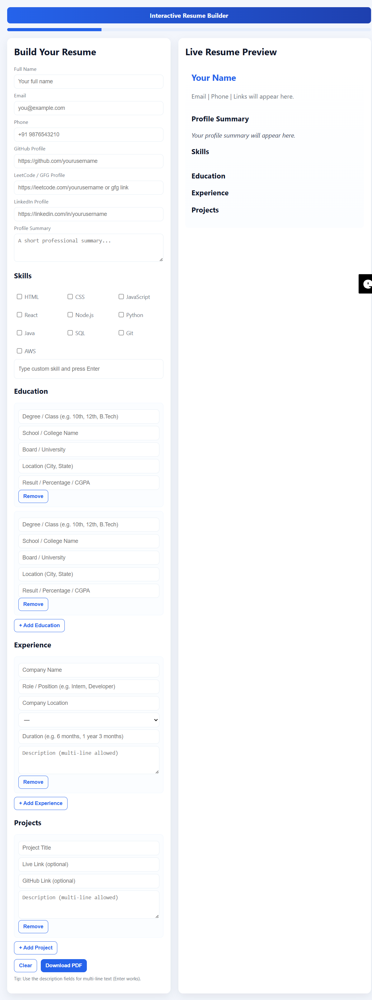

# Resume Builder

A **dynamic and interactive Resume/CV Builder** that allows users to create, customize, preview, and export their professional resumes in real-time.  
Built with **HTML, CSS, and JavaScript**, it provides an elegant and responsive interface that works across all devices.

---

## 🚀 Project Overview

**Resume Builder** helps users craft professional resumes effortlessly.  
It features real-time live preview, dark/light mode, print-to-PDF export, and autosave functionality.  
Designed to be **ATS-friendly**, the generated resumes maintain clean formatting and structure for easy parsing by applicant tracking systems.

**Live Link** [https://vamshikrishan.github.io/Resume_Builder/](https://vamshikrishan.github.io/Resume_Builder/)

---

## ✨ Key Features

- 🧠 **Live Preview:** Instantly updates the resume as the user types — no reload required.  
- 🏆 **Achievements Section:** Highlight awards and recognitions directly within the resume.  
- 🌗 **Dark & Light Mode:** Toggle seamlessly between themes with smooth transitions and saved preferences.  
- 💾 **Autosave Drafts:** All progress is automatically saved using localStorage and restored on reload.  
- 🖨️ **Print / Export to PDF:** Optimized print layout with dedicated print CSS for perfect margins and pagination.  
- 📊 **Resume Analysis Tool:** Analyses resume content and provides keyword match score suggestions.  
- 🧱 **Structured Sections:** Profile, Summary, Experience, Education, Projects, Skills, Achievements — all easily editable.  
- ♿ **Accessibility Support:** Keyboard navigation, ARIA labels, and clear color contrast.  
- 📱 **Responsive Design:** Fully responsive interface for mobile, tablet, and desktop devices.

---

## 🧩 Technologies Used

- **HTML5** – Structure & semantic layout  
- **CSS3** – Styling, theming, responsive design, and animations  
- **JavaScript (ES6)** – Core functionality, live preview, autosave, and analysis logic  
- **LocalStorage API** – Save and restore user resume data  
- **Print CSS** – For PDF-ready export

---

## 🛠️ Installation & Setup

1. **Clone this repository:**
   ```bash
   git clone https://github.com/yourusername/resume-builder-pro.git
    ````

2. **Navigate into the project folder:**

   ```bash
   cd resume-builder-pro
   ```

3. **Open `index.html` in your browser**
   That’s it! The project is fully client-side — no external dependencies needed.

---

## 🧮 Usage Instructions

1. Fill out your details in the **Resume Editor** form (name, email, experience, skills, etc.).
2. Watch your resume update instantly in the **Live Preview** panel at the top.
3. Use the toolbar buttons:

   * **🖨️ Print:** Export your resume to PDF.
   * **🔁 Reset:** Clear all entered data.
   * **📊 Analyse:** Check your keyword score and get improvement tips.
4. Switch between **Dark** 🌑 and **Light** ☀️ modes using the toggle in the header.
5. All your data auto-saves locally — close and reopen anytime without losing progress.

---

## 🎨 Color Themes

| Mode           | Background | Text      | Accent    |
| -------------- | ---------- | --------- | --------- |
| **Dark Mode**  | `#1E1E1E`  | `#FFFFFF` | `#FF7A00` |
| **Light Mode** | `#FAFAFA`  | `#111111` | `#FF7A00` |

---

## 🧠 Resume Analysis Feature

The **Analyse** button scans your resume for key industry-related words (e.g., *leadership, project, design, teamwork, management, communication*)
and provides a **match score** out of 10 with suggestions for improving your ATS compatibility.

---

## 📷 Screenshots



---

## 🧑‍💻 Developer

**Vamshi Krishna**
🎓 Internship Final Project — VaultofCodes

💼 Role: Web Development Intern

📧 Email: [[vamship250106@gmail.com](vamship250106@gmail.com)]

🌐 Portfolio: [[your-portfolio-link](https://vamshikrishan.github.io/portfolio/)]

---

## 📜 License

This project is open-source and available in by GitHub [https://github.com/Vamshikrishan/Resume_Builder](https://github.com/Vamshikrishan/Resume_Builder).

---

## ⭐ Acknowledgments

* Inspired by modern online resume builders like **Novoresume** and **Canva**.
* Designed and developed with guidance of **VaultofCodes**.

---
